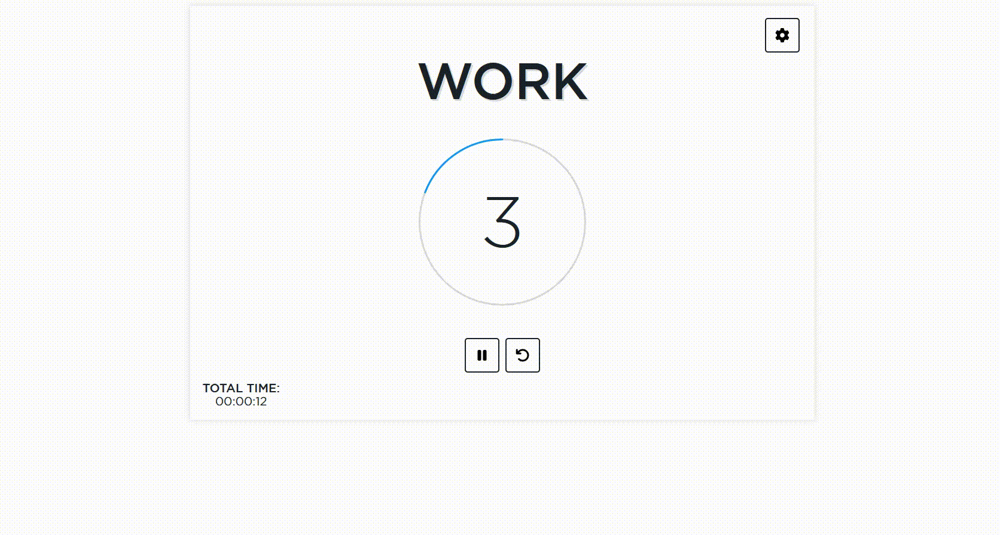
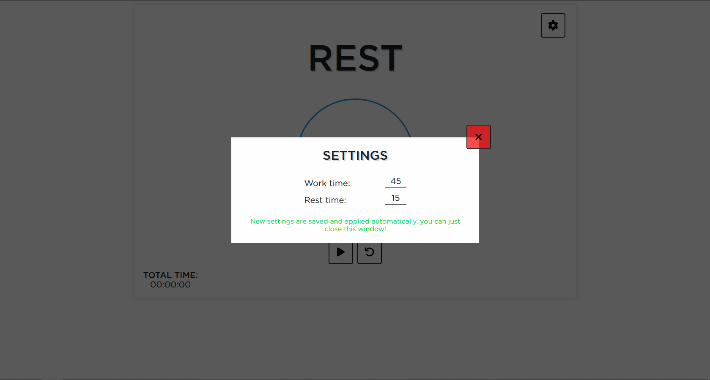
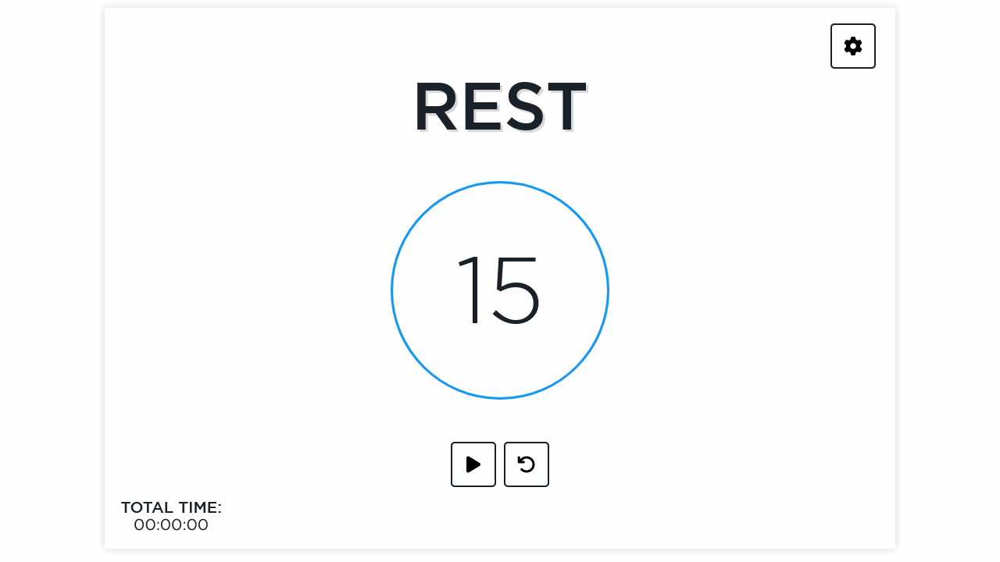

# React HIIT Timer

A simple timer for HIIT type of workouts.

## Main Features

#### 1. Basic HIIT timer with audio cues
#### 2. Total workout time control
#### 3. Timer settings + Settings are saved in local storage

#### 4. Adaptive layout

  

## Planned Features

I'm leaving this project as a MVP of the actual timer app that I wanted to implement as I have more important projects to work on. For now it's just a simple timer, but I'm planning on getting back to it and actually implementing these:

#### 1. Exercises list (Adding, Editing, Deleting exercises) + Drag & Drop Exercises Arrangement
#### 2. Automatic switching between exercises during the workout
#### 3. Creating buttons for switching between exercises manually
#### 4. Counting rounds of workouts + Making settings for rest time between rounds
#### 5. Adding one more modal window with info on how the timer works and how to use it

## Upd: 03.08.2024

I'll get back to this project once I'm back to HIIT type of training.
